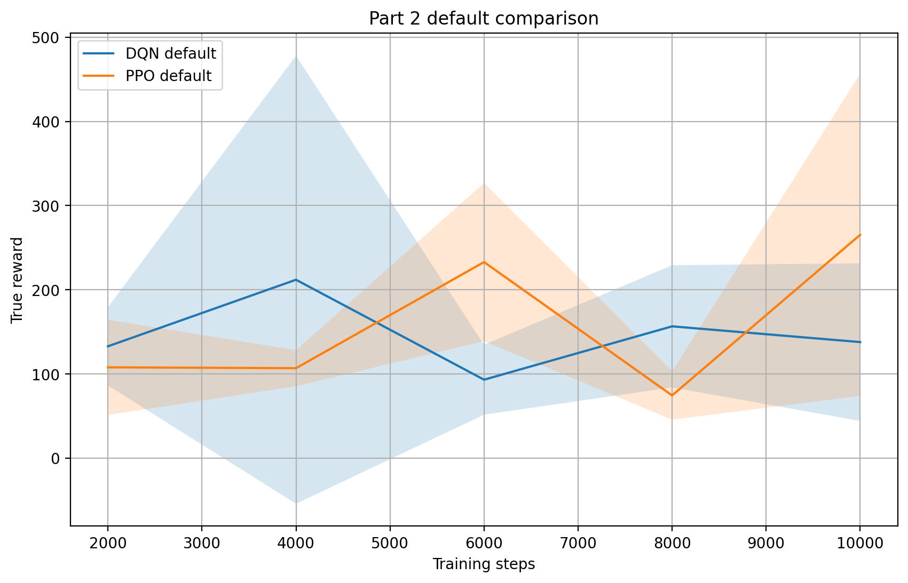
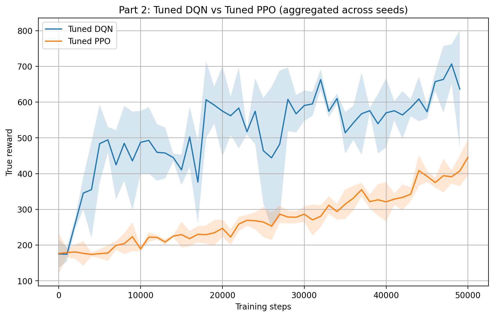
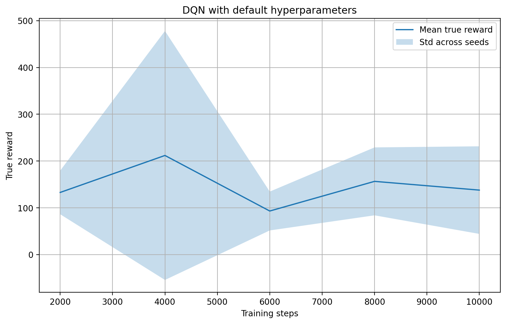
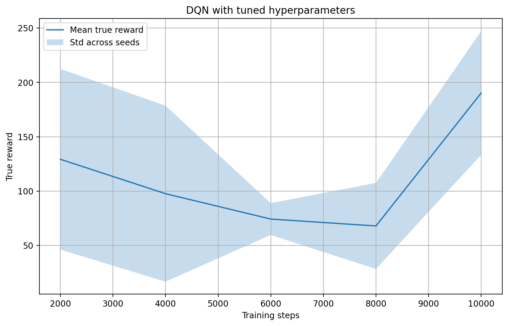
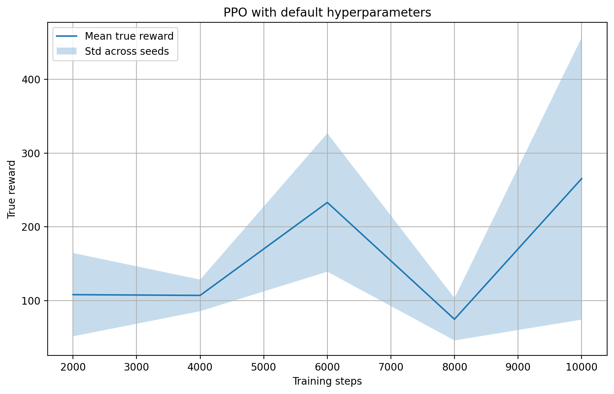
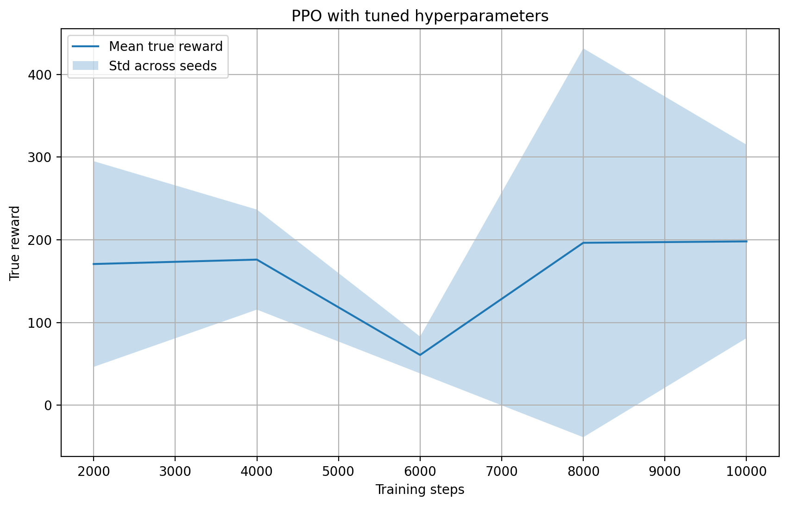
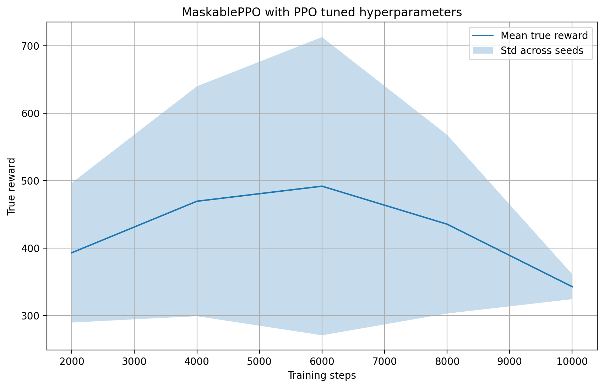
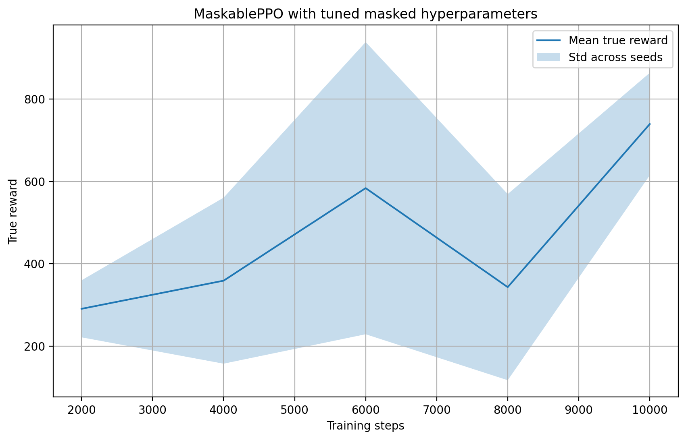
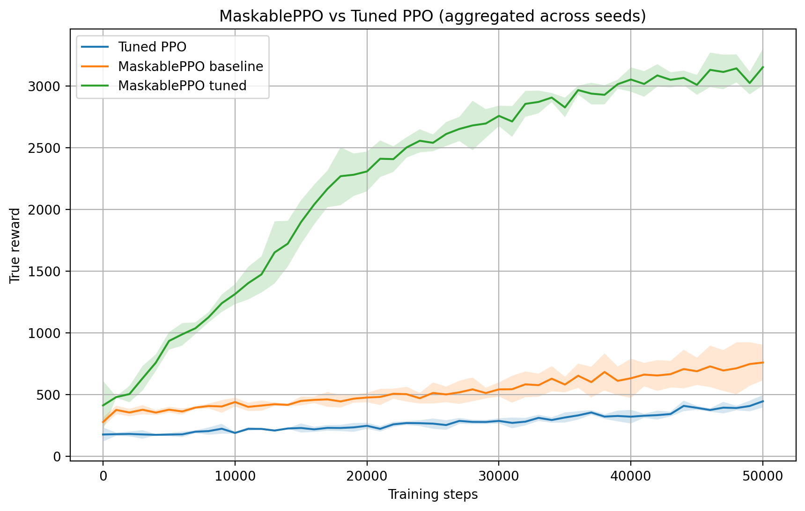

## Part 1: The Environment

The bounded knapsack problem is modeled as a Markov Decision Process (MDP), where an agent sequentially selects items to include in a knapsack with a limited capacity.

- **State:** The current state includes the remaining capacity of the knapsack and information about available items (e.g., weights and values).
- **Action:** At each step, the agent selects an item to include in the knapsack.
- **Reward:** The agent receives a reward equal to the value of the selected item, as long as the capacity constraint is not violated.
- **Transition:** The environment updates the remaining capacity after each selected item.
- **Termination:** The episode ends when no more items can be added without exceeding the capacity.

This formulation allows reinforcement learning agents to learn policies that maximize the total value of selected items.

## Part 2: Training DQN and PPO

### Model Explanation

DQN (Deep Q-Network) is a value-based reinforcement algorithm, which estimates the Q-function with a neural network. It trains on experience replay, performing the task by stabilizing training by minimizing the difference between predicted Q-values and target Q-values with a target network.

PPO (Proximal Policy Optimization) is a policy-based method which aims to directly optimize the policy by using a clipped surrogate goal. This does not allow huge updates and makes learning more consistent than the conventional policy gradient techniques.

---

### Results with Default Hyperparameters

Both DQN and PPO were first trained using default hyperparameters.

The findings indicate that DQN has a large variance and poor consistency in performance with various seeds. Although PPO is also variative, it has a more consistent behavior.

---

### Results with Tuned Hyperparameters

Both of these models were hyperparameter tuned by experimenting with several values of both learning rate and training steps.

After tuning, both models show improved performance. PPO benefits more from tuning, achieving higher rewards and better stability compared to DQN.

---

### Individual Model Behavior

#### DQN (Default vs Tuned)

  

DQN shows unstable learning behavior, with large fluctuations across training steps. Even after tuning, the variance remains relatively high.

#### PPO (Default vs Tuned)

  

PPO demonstrates more stable learning compared to DQN. Tuning improves its performance, especially in later training stages.

---

### Conclusion

In general, PPO has a higher degree of stability and consistency when compared to DQN. Although DQN is able to achieve competitive rewards, it is less reliable due to its large variance. PPO has stronger performance with the various seeds and configurations.

---

## Part 3: Masked PPO

### Approach

In this section invalid action masking is used to avoid infeasible actions being chosen by the agent. The environment gives a mask which filters out invalid actions and a MaskablePPO agent is then trained on such information.

---

### Masked PPO Results

#### Masked PPO using PPO tuned hyperparameters

Applying masking with the PPO tuned hyperparameters already leads to a significant improvement compared to standard PPO.

---

#### Masked PPO with additional tuning

Additional optimization of masked PPO hyperparameters will not have a significant positive effect on the performance, and it can even boost the variance. This implies that the original masked mask was already working.

---

### Comparison with PPO

It is evident in the comparison that Masked PPO does far better than the standard PPO. It has a significantly higher mean reward and the process of learning is more stable.

---

### Conclusion

The masking of invalid actions significantly increases the efficiency with which the agent learns, since the action space is narrowed to the valid actions only. This increases the rewards and more consistent performance.

Surprisingly, further hyperparameter optimization does not give significant performance increases, suggesting that masking as such is the primary determinant of performance increases.